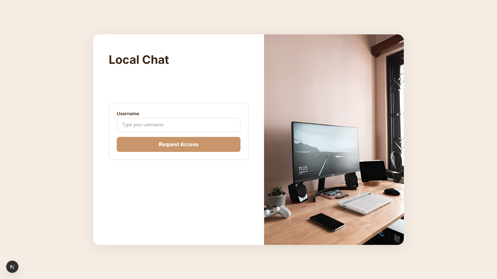
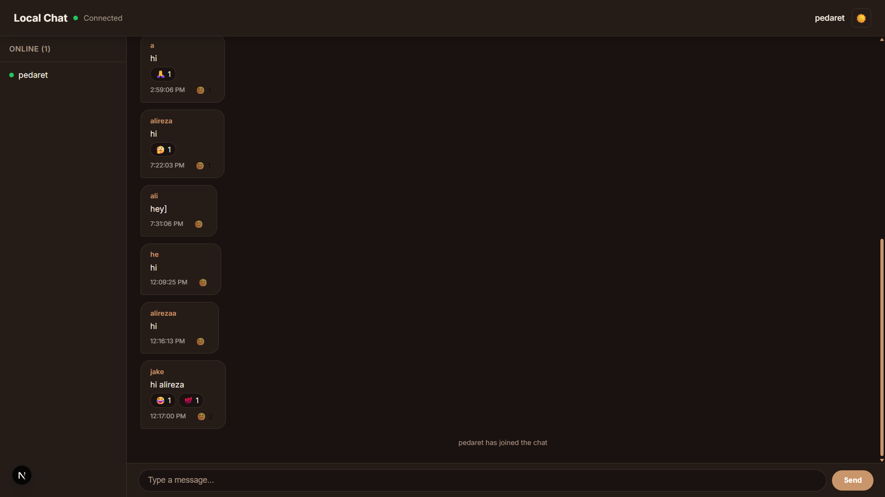

# Local Chat Application

A real-time chat application that runs entirely on your local network using WebSockets. No internet connection required. Built for private, secure communication within a local network — ideal for teams, labs, or home setups.

**Tech Stack:** Django Channels, Next.js, TypeScript, CSS Modules

## Login Page



## Chat View



## Features

- Real-time messaging via WebSockets
- Admin approval system for new users
- Message reactions with emoji picker
- Read/seen status indicators
- Online user presence panel
- Light/dark theme toggle
- Django admin interface with admin-panel UI

> **Note:** SSL encryption is temporarily deactivated due to a known issue. The application currently runs on plain HTTP/WS. SSL support will be restored in a future update.

## Overview

- **Backend:** Django + Channels (ASGI) via Daphne
- **Frontend:** Next.js 16 (React 19, TypeScript, CSS Modules)
- **Communication:** WebSockets (WS)
- **Database:** SQLite
- **Average latency on localhost:** 15-20ms

## How It Works

1. User opens `http://localhost:3000`
2. UsernameModal prompts for a username
3. Username is sent to `/api/request_join/` and stored as a `PendingUser`
4. Admin approves the user via Django admin (`/admin/chat/pendinguser/`)
5. Frontend polls `/api/check_approval/` every 3s
6. On approval, a WebSocket connection is established to `ws://localhost:8000/ws/chat/`
7. Messages are broadcast to all connected clients in real time

## Network Flow

```text
Browser A                 Django (Port 8000)                 Browser B
|                            |                              |
|-- WebSocket handshake ---->|                              |
|<-- Connection accepted ----|                              |
|                            |-- WebSocket handshake ------>|
|                            |<-- Connection accepted ------|
|                            |                              |
|------ "Hello" ------------>|                              |
|                            |------ "Hello" ------------->|
|                            |                              |
|<----------- "Hi" ---------|<----------- "Hi" ------------|
```

## Installation

### Prerequisites

- Python 3.10+
- Node.js 18+
- npm

### 1. Backend Setup (Django)

```bash
cd backend
python -m venv venv
```

**On Mac/Linux:**
```bash
source venv/bin/activate
```

**On Windows:**
```bash
venv\Scripts\activate
```

```bash
pip install -r requirements.txt
python manage.py migrate
python manage.py collectstatic --noinput
python manage.py createsuperuser
```

### 2. Frontend Setup (Next.js)

Open a new terminal:

```bash
cd frontend
npm install
```

## Running the Application

Start the backend:

```bash
cd backend
daphne -b localhost -p 8000 backend.asgi:application
```

Start the frontend:

```bash
cd frontend
npm run dev
```

- Frontend: `http://localhost:3000`
- Backend API: `http://localhost:8000`
- Admin panel: `http://localhost:8000/admin/`

## Admin Approval Workflow

1. Create a superuser: `python manage.py createsuperuser`
2. A user enters their username in the frontend
3. The request appears in Django admin under **Chat > Pending users**
4. Select the user and run **Approve selected users** action
5. The user is automatically connected to the chat

## Project Structure

```
local-chat-app/
├── backend/
│   ├── backend/
│   │   ├── settings.py
│   │   ├── urls.py
│   │   └── asgi.py
│   ├── chat/
│   │   ├── models.py          # ChatMessage, PendingUser
│   │   ├── admin.py           # Admin config with approve action
│   │   ├── views.py           # REST endpoints (request_join, check_approval, etc.)
│   │   ├── consumers.py       # WebSocket consumer (chat, reactions, seen)
│   │   ├── routing.py         # WebSocket URL routing
│   │   └── migrations/
│   ├── manage.py
│   ├── requirements.txt
│   └── db.sqlite3
├── frontend/
│   ├── app/
│   │   └── page.tsx
│   ├── components/
│   │   └── ChatWindow/
│   │       ├── index.tsx            # Main chat component
│   │       ├── ChatWindow.module.css
│   │       ├── MessageFeed.tsx
│   │       ├── MessageBubble.tsx    # Reactions display + picker
│   │       ├── InputBar.tsx
│   │       ├── OnlinePanel.tsx
│   │       ├── UsernameModal.tsx    # Approval request UI
│   │       └── ReactionPicker.tsx
│   ├── hooks/
│   │   ├── use-websocket.ts         # WebSocket hook
│   │   └── useSeenStatus.ts
│   ├── types/
│   │   └── index.tsx
│   ├── utils/
│   │   └── api.ts
│   ├── package.json
│   └── next.config.ts
├── README.md
└── .gitignore
```

## API Endpoints

| Method | Path | Description |
|--------|------|-------------|
| POST | `/api/request_join/` | Submit username for admin approval |
| GET | `/api/check_approval/?username=X` | Poll approval status |
| POST | `/api/toggle_reaction/` | Toggle emoji reaction on a message |
| POST | `/api/mark_seen/` | Mark a message as seen |

## WebSocket Events

| Event | Direction | Description |
|-------|-----------|-------------|
| `chat_message` | Server -> Client | New message broadcast |
| `system_message` | Server -> Client | System notification |
| `online_users_message` | Server -> Client | Online user list update |
| `seen_event` | Server -> Client | Read receipt update |
| `reaction_update` | Server -> Client | Reaction toggle broadcast |
| `reaction` | Client -> Server | Send a reaction |

## Contributing

Contributions are welcome! Here are some features that could be added:

- **File & Image Sharing** — Allow users to send images, files, and media in chat
- **Private Messaging** — Direct messages between two users
- **Chat Rooms** — Support for multiple chat rooms/channels
- **Message Editing & Deletion** — Edit or delete sent messages
- **Typing Indicators** — Show when another user is typing
- **Message Search** — Search through chat history
- **User Avatars** — Profile pictures for users
- **Notifications** — Desktop notifications for new messages
- **Message Pinning** — Pin important messages to the top
- **User Roles & Permissions** — Role-based access (admin, moderator, member)
- **Chat Export** — Export chat history as text or JSON
- **Restore SSL Encryption** — Re-enable WSS with proper certificate handling
